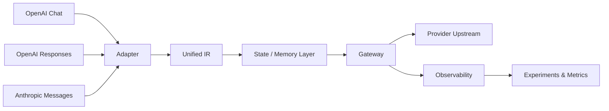

<div align="center">

# Protocol Converter

### OpenAI ↔ Anthropic protocol interoperability with state, memory, and cache observability

[](https://github.com/XuWenboooo/-OpenAI-/actions/workflows/ci.yml)


**A protocol translation gateway that converts between OpenAI Chat / Responses and Anthropic Messages through a unified intermediate representation, while studying the trade-off between memory injection and KV-cache reuse.**

</div>

---

## Why this project exists

Modern LLM applications are often coupled to one provider's request format, conversation model, caching semantics, and state behavior. This project explores a different design:

> **Put protocol differences behind a stable intermediate representation, then make state, memory, and cache behavior observable.**

The goal is not only to translate JSON payloads. The system also asks a systems question:

**How much memory/context should be injected into a conversation before the extra context begins to hurt cache reuse, latency, or cost?**

---

## Core capabilities

<table>
<tr>
<td width="50%" valign="top">

### 🔄 Protocol interoperability

- OpenAI Chat adapter
- OpenAI Responses adapter
- Anthropic Messages adapter
- Unified IR as the protocol contract
- Request / response conversion in both directions

</td>
<td width="50%" valign="top">

### 🧠 Stateful conversations

- SQLite-backed session state
- TTL and session-boundary configuration
- `previous_response_id` tracking
- Configurable session memory limits
- Memory injection with idempotent deduplication

</td>
</tr>
<tr>
<td width="50%" valign="top">

### 📊 Cache observability

- Cache-read hit-rate instrumentation
- Provider usage parsing
- Warm-up requests separated from measured requests
- Controlled memory × cache experiments
- Reproducible experiment snapshots

</td>
<td width="50%" valign="top">

### 🌐 Gateway & orchestration

- HTTP forwarding
- SSE streaming pass-through
- Concurrency limiting
- Mock mode for offline testing
- Local orchestration panel
- Host validation and one-time access token

</td>
</tr>
</table>

---

## Architecture



### Main modules

| Module | Responsibility |
|---|---|
| `src/ir/schema.py` | IR contract and conversation/cache context model |
| `src/adapters/` | OpenAI Chat / Responses / Anthropic conversion |
| `src/state/store.py` | SQLite state, TTL, response IDs, memory limits |
| `src/observability/metrics.py` | Cache and usage metrics |
| `src/gateway/server.py` | HTTP gateway, SSE, memory injection, limits |
| `src/experiments/run_experiments.py` | Controlled memory × cache experiments |
| `src/webpanel/app.py` | Local session/orchestration UI |

---

## Quick start

### 1. Install

```bash
python -m venv .venv
# Windows PowerShell: .\.venv\Scripts\Activate.ps1
# Linux/macOS: source .venv/bin/activate

pip install -r requirements.txt
```

### 2. Configure keys only when using real upstreams

Copy `.env.example` or export environment variables in your shell.

```text
OPENAI_API_KEY=
ANTHROPIC_API_KEY=
```

> Never commit real API keys. Local `.env` files are ignored by Git.

### 3. Run the offline experiment path

```bash
python -m src.experiments.run_experiments --data-dir data
```

### 4. Run the gateway in mock mode

```bash
python -m src.gateway.server --mock --port 8096
```

Example request:

```bash
curl -X POST http://127.0.0.1:8096/v1/messages \
  -H "content-type: application/json" \
  -d '{"model":"claude-opus-5","system":"you are an assistant","messages":[{"role":"user","content":[{"type":"text","text":"hi"}]}]}'
```

### 5. Run the local orchestration panel

```bash
python -m src.webpanel.app --port 0
```

### 6. Test

```bash
pytest tests/ -q
```

The repository contains adapter, core, and gateway test suites under `tests/`.

---

## Real upstream mode

Mock mode is the safest way to explore the system locally. To forward requests to a real provider, configure the corresponding environment variable first.

PowerShell example:

```powershell
$env:ANTHROPIC_API_KEY="..."
python -m src.gateway.server --port 8096
```

For an OpenAI upstream, use `OPENAI_API_KEY` with the gateway's OpenAI upstream option.

---

## Experiment focus: memory injection × KV cache

The experimental layer varies factors such as:

- memory update frequency
- injection position
- memory granularity
- provider/model cache thresholds
- warm-up versus measured requests

The aim is to quantify a practical systems trade-off:

```text
more injected context
        │
        ├── potentially better task memory
        │
        └── potentially lower cache reuse / higher cost / higher latency
```

The main written analysis is maintained in:

- `docs/量化取舍文档.md`

---

## Engineering and security choices

This repository intentionally keeps several operational boundaries explicit:

- API keys are read from environment variables rather than source code
- `.env` and local runtime state are excluded from version control
- the local panel binds to loopback and uses Host validation / a one-time token
- mock mode allows protocol behavior to be tested without provider credentials
- experiment outputs are separated from the source tree's authoritative documentation

---

## Project status

| Area | Status |
|---|---|
| Unified IR | ✅ Implemented |
| Protocol adapters | ✅ Implemented |
| Observability | ✅ Implemented |
| Stateful session layer | ✅ Implemented |
| Gateway / SSE path | ✅ Implemented |
| Controlled experiment layer | ✅ Implemented |
| Local orchestration panel | ✅ Implemented |
| Automated tests | ✅ Present |
| GitHub Actions CI | 🧪 Being introduced through repository refactoring |
| Real-provider validation matrix | 🚧 Requires provider credentials / further verification |

### Remaining validation work

- `previous_response_id` conflict behavior
- 20-block history-window behavior
- provider/model threshold table validation
- `count_tokens` RTT measurements
- large-block cache threshold re-tests

---

## Documentation

- `docs/量化取舍文档.md` — memory injection × KV-cache quantitative trade-off
- `docs/ir-schema.md` — IR contract
- `docs/工具ID映射表与能力矩阵.md` — tool ID mapping and capability matrix
- `docs/完成度评测报告.md` — completion evaluation
- `docs/评审综述.md` — functional/review summary
- `docs/TRACK04_签字确认稿.md` — session-boundary configuration evidence

---

## Background

This project was originally developed for **犀牛鸟开源实战 · TRACK 05A / 05B**. The original task context remains useful, but the repository is being refactored so that the engineering problem can stand on its own:

**protocol interoperability + state management + cache-aware LLM systems evaluation.**

---

## Repository roadmap

- [x] Add automated tests
- [x] Add safe environment-variable template
- [x] Add CI workflow
- [x] Standardize pytest configuration
- [ ] Rename the repository to `protocol-converter`
- [ ] Standardize the default branch to `main`
- [ ] Add an explicit open-source license after license choice is confirmed
- [ ] Expand reproducible benchmark/result summaries
- [ ] Complete real-provider validation
