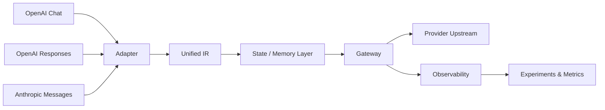

<div align="center">

# Protocol Converter

### OpenAI ↔ Anthropic protocol interoperability with state, memory, and cache observability

[](https://github.com/XuWenboooo/protocol-converter/actions/workflows/ci.yml)


**A protocol translation gateway that converts between OpenAI Chat / Responses and Anthropic Messages through a unified intermediate representation, while studying the trade-off between memory injection and KV-cache reuse.**

</div>

---

## Why this project exists

Modern LLM applications are often coupled to one provider's request format, conversation model, caching semantics, and state behavior. This project explores a different design:

> **Put protocol differences behind a stable intermediate representation, then make state, memory, degradation, and cache behavior observable.**

The goal is not only to translate JSON payloads. The system also asks a systems question:

**How much memory/context should be injected into a conversation before the extra context begins to hurt cache reuse, latency, or cost?**

---

## Core capabilities

<table>
<tr>
<td width="50%" valign="top">

### 🔄 Protocol interoperability

- OpenAI Chat adapter
- OpenAI Responses adapter
- Anthropic Messages adapter
- Unified IR as the protocol contract
- Request / response conversion in both directions
- Explicit tracking of dropped / degraded fields

</td>
<td width="50%" valign="top">

### 🧠 Stateful conversations

- SQLite-backed session state
- TTL and session-boundary configuration
- `previous_response_id` tracking
- Configurable session memory limits
- Memory injection with idempotent deduplication

</td>
</tr>
<tr>
<td width="50%" valign="top">

### 📊 Cache observability

- Cache-read hit-rate instrumentation
- Provider usage normalization
- Warm-up requests separated from measured requests
- Controlled memory × cache experiments
- Reproducible experiment assumptions

</td>
<td width="50%" valign="top">

### 🌐 Gateway & orchestration

- HTTP forwarding
- SSE streaming pass-through
- Concurrency limiting
- Mock mode for offline testing
- Local orchestration panel
- Host validation and one-time access token

</td>
</tr>
</table>

---

## Architecture



### Main modules

| Module | Responsibility |
|---|---|
| `src/ir/schema.py` | IR contract and conversation/cache context model |
| `src/adapters/` | OpenAI Chat / Responses / Anthropic conversion |
| `src/state/store.py` | SQLite state, TTL, response IDs, memory limits |
| `src/observability/metrics.py` | Cache and usage metrics |
| `src/gateway/server.py` | HTTP gateway, SSE, memory injection, limits |
| `src/experiments/run_experiments.py` | Controlled memory × cache experiments |
| `src/webpanel/app.py` | Local session/orchestration UI |

For a fuller component and request-lifecycle view, see [`docs/ARCHITECTURE.md`](docs/ARCHITECTURE.md).

---

## Quick start

### 1. Runtime install

```bash
python -m venv .venv
# Windows PowerShell: .\.venv\Scripts\Activate.ps1
# Linux/macOS: source .venv/bin/activate

pip install -r requirements.txt
```

For development / testing:

```bash
pip install -r requirements-dev.txt
```

### 2. Configure keys only when using real upstreams

Use `.env.example` as a template or export environment variables in your shell.

```text
OPENAI_API_KEY=
ANTHROPIC_API_KEY=
```

> Never commit real API keys. Local `.env` files are ignored by Git.

### 3. Run the offline experiment path

```bash
python -m src.experiments.run_experiments --data-dir data
```

### 4. Run the gateway in mock mode

```bash
python -m src.gateway.server --mock --port 8096
```

Example request:

```bash
curl -X POST http://127.0.0.1:8096/v1/messages \
  -H "content-type: application/json" \
  -d '{"model":"claude-opus-5","system":"you are an assistant","messages":[{"role":"user","content":[{"type":"text","text":"hi"}]}]}'
```

### 5. Run the local orchestration panel

```bash
python -m src.webpanel.app --port 0
```

### 6. Test

```bash
pytest tests/ -q
```

CI runs the same suite on Python 3.11 and 3.12.

---

## Experiment focus: memory injection × KV cache

The experimental layer varies:

- memory update frequency
- injection position
- memory granularity
- provider/model cache thresholds
- warm-up versus measured requests

The practical systems trade-off is:

```text
more injected context
        │
        ├── potentially better task memory
        │
        └── potentially lower cache reuse / higher cost / higher latency
```

### Controlled offline result snapshot

> **Evidence level: CONTROLLED_EXPERIMENT / MOCK** — these are offline controlled results, not current production-provider measurements.

| Strategy | Cache hit rate | Estimated measured cost | Interpretation |
|---|---:|---:|---|
| no-memory baseline | 100% | $0.0200 | stable prefix after warm-up |
| inject once at session start | 100% | $0.0233 | preferred stable-memory strategy under tested assumptions |
| dynamic injection every turn | 0% | $0.0422 | prefix instability eliminates cache reuse in the model |
| stable prefix placement | 100% | $0.0233 | semantically preferred placement |

The full experiment includes additional granularity and threshold groups. See:

- [`docs/RESULTS_SUMMARY.md`](docs/RESULTS_SUMMARY.md) — concise experiment summary
- [`docs/量化取舍文档.md`](docs/量化取舍文档.md) — full quantitative analysis
- [`docs/REPRODUCIBILITY.md`](docs/REPRODUCIBILITY.md) — evidence levels and reproduction protocol

---

## Real upstream mode

Mock mode is the safest way to explore the system locally. To forward requests to a real provider, configure the corresponding environment variable first.

PowerShell example:

```powershell
$env:ANTHROPIC_API_KEY="..."
python -m src.gateway.server --port 8096
```

For an OpenAI upstream, use `OPENAI_API_KEY` with the gateway's OpenAI upstream option.

### Evidence boundary

Offline tests and mock experiments validate repository behavior under controlled assumptions. They do **not** automatically prove that current provider APIs, pricing, cache thresholds, or undocumented behavior remain unchanged.

Real-provider claims should carry a validation date and model/API context.

---

## Engineering and security choices

This repository intentionally keeps operational boundaries explicit:

- API keys are read from environment variables rather than source code
- `.env` and local runtime state are excluded from version control
- the local panel binds to loopback and uses Host validation / a one-time token
- mock mode allows protocol behavior to be tested without provider credentials
- lossy protocol behavior should be visible instead of silently hidden
- experiment outputs are separated from source-controlled authoritative documentation

See [`SECURITY.md`](SECURITY.md) for threat-model notes and vulnerability-reporting guidance.

---

## Project status

| Area | Status |
|---|---|
| Unified IR | ✅ Implemented |
| Protocol adapters | ✅ Implemented |
| Observability | ✅ Implemented |
| Stateful session layer | ✅ Implemented |
| Gateway / SSE path | ✅ Implemented |
| Controlled experiment layer | ✅ Implemented |
| Local orchestration panel | ✅ Implemented |
| Automated tests | ✅ Present |
| GitHub Actions CI | ✅ Python 3.11 / 3.12 |
| Dev / runtime dependency split | ✅ |
| Security guidance | ✅ |
| Contribution workflow | ✅ |
| Reproducibility guide | ✅ |
| Real-provider validation matrix | 🚧 Requires provider credentials / dated verification |

### Remaining external-validation work

- `previous_response_id` conflict behavior against current provider APIs
- long-history / cache-window behavior
- provider/model threshold table validation
- `count_tokens` RTT measurements
- large-block cache threshold re-tests

---

## Repository workflow

Contributions should use short-lived branches and pull requests. See [`CONTRIBUTING.md`](CONTRIBUTING.md).

CI is expected to pass before merge. Protocol or experiment changes should document any lossy conversion, changed cache semantics, or altered experimental assumptions.

---

## Documentation index

- [`docs/ARCHITECTURE.md`](docs/ARCHITECTURE.md) — system architecture and request lifecycle
- [`docs/REPRODUCIBILITY.md`](docs/REPRODUCIBILITY.md) — clean-environment reproduction and evidence levels
- [`docs/RESULTS_SUMMARY.md`](docs/RESULTS_SUMMARY.md) — compact experiment results
- [`docs/量化取舍文档.md`](docs/量化取舍文档.md) — memory injection × KV-cache quantitative trade-off
- [`docs/ir-schema.md`](docs/ir-schema.md) — IR contract
- [`docs/工具ID映射表与能力矩阵.md`](docs/工具ID映射表与能力矩阵.md) — tool ID mapping and capability matrix
- [`docs/完成度评测报告.md`](docs/完成度评测报告.md) — completion evaluation
- [`docs/评审综述.md`](docs/评审综述.md) — functional/review summary
- [`docs/TRACK04_签字确认稿.md`](docs/TRACK04_签字确认稿.md) — session-boundary configuration evidence

---

## Background

The repository originated from the 犀牛鸟开源实战 TRACK 05A / 05B protocol-conversion track. That context motivated the original deliverables, but the repository is now structured as an independently understandable LLM-systems project rather than only a competition snapshot.

---

## License

Apache License 2.0. See [`LICENSE`](LICENSE).
